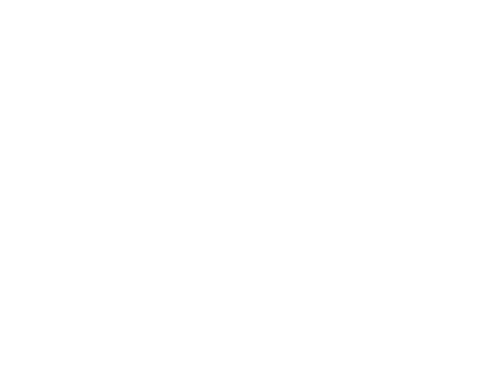

# Medical Insurance Cost Prediction using Multiple Linear Regression

## Objective
To build a Multiple Linear Regression model that predicts medical insurance charges based on personal and health-related information such as age, sex, BMI, number of children, smoking status, and region.

## Dataset
[Medical Cost Personal Insurance Dataset (Kaggle)](https://www.kaggle.com/datasets/mirichoi0218/insurance)

The dataset contains 1,338 records with the following columns:

| Column | Type | Description |
|---|---|---|
| age | Numerical | Age of the primary beneficiary |
| sex | Categorical | Gender (male/female) |
| bmi | Numerical | Body mass index |
| children | Numerical | Number of dependents covered |
| smoker | Categorical | Smoking status (yes/no) |
| region | Categorical | Residential area in the US |
| charges | Numerical (Target) | Individual medical costs billed |

## Libraries Used
- pandas
- numpy
- scikit-learn
- matplotlib

## Methodology
1. **Data Understanding** — Loaded the dataset, inspected the first five records, and identified numerical features (age, bmi, children), categorical features (sex, smoker, region), and the target variable (charges).
2. **Data Preprocessing** — Verified there were no missing values. Encoded `sex` and `smoker` using label encoding, and `region` using one-hot encoding. Split the data into 80% training and 20% testing sets.
3. **Model Development** — Trained a Multiple Linear Regression model on the training set using all six features to predict `charges`.
4. **Model Evaluation** — Evaluated the model on the test set using MAE, MSE, and R², and visualized predictions against actual values.

## Results

| Metric | Value |
|---|---|
| MAE | 4181.19 |
| MSE | 33,596,915.85 |
| R² Score | 0.7836 |

### Actual vs Predicted Charges

### Observations
- The model explains about **78%** of the variance in insurance charges (R² = 0.78), indicating a reasonably strong linear fit.
- **Smoking status** is by far the most influential feature — smokers have dramatically higher predicted charges than non-smokers, all else equal.
- The model tends to **underpredict** for individuals with very high actual charges, visible as points falling below the diagonal line at the upper end of the plot — a pattern typical when the true relationship isn't fully linear.

## Conclusion
This project built a Multiple Linear Regression model to predict medical insurance charges based on age, sex, BMI, number of children, smoking status, and region. The model achieved an R² score of approximately 0.78, indicating a reasonably strong fit. Smoking status emerged as the most influential factor, followed by BMI and age, while region had a comparatively minor effect. These findings align with real-world expectations, as smokers and older individuals with higher BMI generally incur higher medical costs.

One key limitation of Linear Regression here is its assumption of a linear relationship between features and charges. In reality, the interaction between smoking and BMI has a non-linear, compounding effect on costs, which a linear model cannot fully capture. More flexible models like polynomial regression or tree-based methods could improve predictive accuracy.